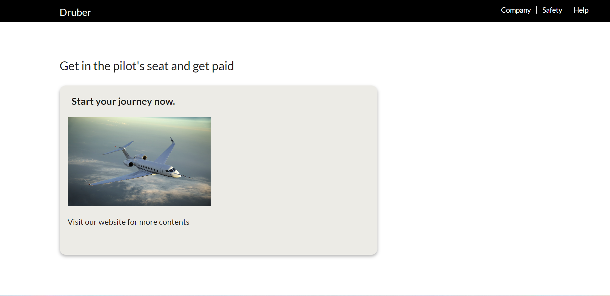

# Druber - UBC Launch Pad Technical Challenge

## Frontend Problem Description

You and your friends are developing a new start-up called DRUBER, a drone-based ride share application that carries you to your destination. The original specification was to develop a web page that works in 1920x1080 however your company has realized that it is missing an entire market of smartphone users. Describe how you can modify your code to work in smartphone resolutions e.g. 750x1334 (iPhone 8). Please give specific examples where possible, but do not implement an entire DRUBER clone!

## Diving into the Problem

Let's dive into creating a web page that looks great for desktop users.

As you can see from the image above, the padding and position of the elements look great, right? We can see that it does on a 1920x1080 screen, but how would the design look if we switch to a mobile display without refactoring or changing any of the existing code?

It seems like the positioning of the elements were suitable for desktop display but not for mobile display. So how can we fix the issue so that it looks good for both?

## Solution

I implemented the following code below so that it is compatitable for screens with widths 750 pixels and below:

/_ Design to fit mobile users: _/

@media (max-width: 750px) {
.title {
padding-left: 5%;
position: relative;
color: azure;
font-size: 25px;
padding-top: 20px;
}
}

@media (max-width: 750px) {
ul.druber-list {
position: relative;
list-style: none;
color: white;
}
}

@media (max-width: 750px) {
.phrase {
padding-left: 0%;
text-align: center;
padding-top: 100px;
}
}

@media (max-width: 750px) {
.info-card {
width: fit-content;
padding-left: 0%;
box-shadow: 0 4px 8px 0 rgba(0, 0, 0, 0.3);
text-align: center;
border-radius: 16px;
background-color: #edebe6;
}
}

@media (max-width: 750px) {
.container {
width: 100%;
padding-top: 40px;
padding-left: 8%;
}
}

@media (max-width: 750px) {
p {
width: 100%;
padding-top: 40px;
padding-left: 8%;
padding-bottom: 20%;
}
}

Now let's see how that would look...

The design looks so much better than before, right?
